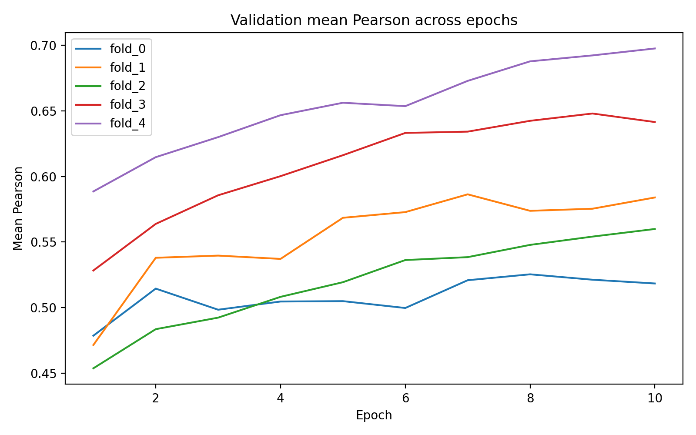

# Apprentissage cross-modal entre histologie H&E et transcriptomique spatiale

## Vue d’ensemble

Ce projet explore l’apprentissage cross-modal entre des **patchs histologiques H&E** et des **signaux de transcriptomique spatiale** à partir d’un sous-ensemble public de HEST.

L’objectif initial était d’apprendre un **espace latent partagé** entre des patchs d’images et des profils locaux d’expression génique, puis d’évaluer cet espace via une tâche de **retrieval cross-modal exact au niveau du spot**.  
Après validation complète du pipeline de bout en bout, le projet a évolué vers une tâche plus stable et plus informative : **la prédiction de l’expression génique à partir des patchs histologiques**.

En pratique, le projet s’est structuré en deux branches :

1. **Branche retrieval contrastif**  
   Apprendre des embeddings alignés image/gènes et tenter de retrouver le spot exact dans un échantillon laissé de côté.

2. **Branche régression génique**  
   Prédire directement un ensemble de **50 gènes hautement variables (HVG)** à partir d’un patch histologique.

La conclusion principale est la suivante :

- la tâche de **retrieval exact spot-à-spot** s’est révélée trop faible et trop instable dans ce setup ;
- la tâche de **régression de l’expression génique** a produit un signal beaucoup plus robuste et exploitable.

---

## Données et protocole

### Source des données

Le projet utilise un petit sous-ensemble de HEST contenant :

- **5 échantillons**
- **10 743 spots spatiaux** au total
- des données appariées :
  - **WSI H&E**
  - **transcriptomique spatiale** au format `.h5ad`
  - métadonnées par échantillon

### Caractéristiques observées du sous-ensemble

- organe : **sein**
- technologie : **Visium HD**
- code oncotree : **IDC**

### Identifiants des échantillons

- `TENX180`
- `TENX182`
- `TENX183`
- `TENX184`
- `TENX185`

### Prétraitement visuel

Pour chaque spot :

- les coordonnées ont été lues depuis le fichier `.h5ad`
- un patch a été extrait directement depuis la WSI
- deux tailles de patch ont été explorées :
  - **224 × 224**
  - **448 × 448**, ensuite redimensionnés en 224 pour l’entrée du modèle

### Cibles moléculaires

Pour chaque fold :

- les gènes ont été alignés entre échantillons ;
- l’intersection des gènes disponibles a été calculée ;
- **50 HVG** ont été sélectionnés **uniquement sur le train** ;
- les features train/test ont ensuite été construites avec exactement les mêmes 50 gènes, dans le même ordre.

Cela évite les fuites d’information et garantit la cohérence stricte entre train et test.

### Protocole d’évaluation

Le protocole utilisé est un **leave-one-sample-out cross-validation (LOSO)** :

- 5 folds
- à chaque fold :
  - 4 échantillons pour l’entraînement
  - 1 échantillon pour le test

Ce protocole est plus strict qu’un split aléatoire de patchs, car il évalue le transfert vers une lame laissée de côté, au lieu de mesurer une simple mémorisation du style visuel d’une même lame.

---

## Pipeline du projet

### 1. Filtrage des métadonnées et téléchargement du sous-ensemble
- filtrage des métadonnées HEST
- sélection des échantillons
- téléchargement uniquement du sous-ensemble nécessaire

### 2. Construction des manifests
- manifest au niveau échantillon
- manifest au niveau spot
- extraction des coordonnées et des chemins de fichiers

### 3. Extraction des patchs depuis les WSI
- extraction exacte autour de chaque spot spatial
- sauvegarde des patchs sur disque
- reconstruction des manifests avec les patchs extraits

### 4. Génération des folds
- split LOSO par échantillon
- aucune fuite entre échantillons

### 5. Construction des features géniques
- lecture des `.h5ad`
- alignement des gènes
- calcul des 50 HVG sur le train uniquement
- génération des CSV train/test pour chaque fold

### 6. Modélisation
Deux branches ont été explorées :

- **retrieval contrastif image ↔ gènes**
- **régression image → gènes**

---

# Branche 1 — Retrieval contrastif

## Objectif

Apprendre un espace latent commun entre :

- un patch histologique
- le vecteur génique du spot correspondant

Puis évaluer si le bon spot peut être retrouvé parmi tous les candidats du set de test.

## Formulation

- encodeur image
- encodeur gènes
- têtes de projection
- loss InfoNCE symétrique
- évaluation avec :
  - `R@1`
  - `R@5`
  - `R@10`

## Ce qui a été testé

### A. Encodeur image ResNet18
Configurations explorées :

- ResNet18 pré-entraîné sur ImageNet
- backbone complètement gelé
- fine-tuning partiel avec `layer4`
- patchs 224 et 448
- gradient accumulation pour simuler un batch effectif plus grand

### B. Encodeur image Phikon
Un backbone pré-entraîné en histopathologie a également été testé en mode gelé.

## Résultats contrastifs

La tâche de retrieval exact au niveau du spot est restée difficile et instable.

### Meilleurs scores observés

| Modèle | Patchs | Entraînement | Meilleur R@1 | Meilleur R@5 | Meilleur R@10 |
|---|---:|---|---:|---:|---:|
| ResNet18 | 224 | backbone gelé | 0.0008 | 0.0055 | 0.0118 |
| ResNet18 | 448 | fine-tuning `layer4` | 0.0013 | 0.0050 | 0.0097 |
| Phikon | 448 | backbone gelé | 0.0008 | 0.0034 | 0.0063 |

### Interprétation

Ces scores restent seulement légèrement au-dessus d’un régime quasi-aléatoire pour un espace de recherche de cette taille.  
La branche contrastive reste néanmoins utile, car elle a permis de valider :

- le pipeline de données ;
- l’alignement spot ↔ patch ;
- le setup d’apprentissage multimodal ;
- l’entraînement sur GPU ;
- la faisabilité d’un appariement exact cross-modal.

En revanche, elle n’a pas fourni un résultat suffisamment fort pour constituer l’axe principal du projet.

### Conclusion principale de la branche contrastive

La formulation **retrieval exact spot-à-spot** est trop difficile et trop instable dans ce setup :

- seulement 5 échantillons ;
- diversité limitée ;
- fort décalage de domaine entre lames ;
- objectif de retrieval un-à-un très exigeant.

Cela a motivé le pivot vers une tâche de **régression génique**.

---

# Branche 2 — Régression de l’expression génique

## Objectif

Prédire les **50 HVG** d’un spot directement à partir de son patch H&E.

Cette formulation reste cross-modale, mais remplace le retrieval exact par un objectif supervisé plus stable et plus informatif.

## Modèle

Le modèle principal utilisé est :

- backbone **ResNet18** pré-entraîné sur ImageNet
- fine-tuning partiel de **`layer4`**
- tête de régression MLP
- entrée : patchs extraits des WSI
- loss : **MSE**

## Pourquoi cette branche marche mieux

Par rapport au retrieval exact, la régression :

- fournit un signal d’apprentissage plus dense ;
- ne demande pas au modèle d’identifier exactement un spot parmi des milliers de candidats ;
- permet d’utiliser des métriques continues et interprétables ;
- correspond mieux au véritable objectif biologique : relier la morphologie à l’état moléculaire local.

---

## Résultats finaux de la branche régression

### Meilleurs résultats par fold

| Fold | Meilleur epoch | Meilleur mean Pearson | Meilleur MSE | Meilleur MAE |
|---|---:|---:|---:|---:|
| fold_0 | 7 | 0.5106 | 1.7336 | 1.0795 |
| fold_1 | 7 | 0.5864 | 0.2701 | 0.4087 |
| fold_2 | 10 | 0.5599 | 0.2688 | 0.3979 |
| fold_3 | 9 | 0.6479 | 0.5608 | 0.6007 |
| fold_4 | 10 | 0.6975 | 0.4800 | 0.5728 |

### Résumé cross-validation

- **Moyenne des meilleurs Pearson sur les folds :** **0.6005**
- **Écart-type :** **0.0735**
- Intervalle observé :
  - min = **0.5106**
  - max = **0.6975**

## Interprétation

C’est le **résultat principal** du projet.

Un mean Pearson autour de **0.60** en cross-validation LOSO indique un **signal prédictif non trivial** entre la morphologie locale et l’expression génique locale.

La variabilité entre folds est également informative :

- certains échantillons laissés de côté sont clairement plus difficiles ;
- le décalage entre lames joue un rôle important ;
- mais le signal reste positivement présent sur tous les folds.

Cette branche est donc beaucoup plus convaincante que la branche retrieval.

---

## Résultats principaux à retenir

### 1. Le pipeline multimodal de bout en bout fonctionne
Le projet implémente correctement :

- le filtrage du sous-ensemble HEST ;
- la construction des manifests spatiaux ;
- l’extraction des patchs depuis les WSI ;
- la génération des splits LOSO ;
- la construction des features géniques ;
- l’entraînement multimodal sur GPU.

### 2. Le retrieval était une baseline exploratoire utile, mais pas la bonne tâche finale
La branche contrastive a montré que le problème d’alignement image/gènes est pertinent, mais difficile dans une formulation stricte de retrieval exact.

### 3. Un contexte spatial plus large aide légèrement
Passer de patchs 224 à 448 améliore légèrement les performances de retrieval, ce qui suggère que le signal transcriptomique dépend partiellement d’un contexte tissulaire plus large.

### 4. La régression génique est la formulation la plus forte dans ce setup
La prédiction des HVG depuis les patchs histologiques produit un signal beaucoup plus stable et beaucoup plus exploitable que le retrieval exact.

---

## Reproductibilité

### Étapes principales
1. télécharger / filtrer le sous-ensemble
2. construire les manifests
3. extraire les patchs
4. créer les folds LOSO
5. construire les features géniques
6. lancer la branche contrastive
7. lancer la branche régression
8. agréger les résultats en cross-validation

### Run principal de la branche régression

La branche principale utilise :

- patchs extraits avec un contexte visuel plus large ;
- protocole LOSO ;
- 50 HVG ;
- ResNet18 pré-entraîné ;
- fine-tuning de `layer4` ;
- Pearson moyen comme métrique principale de validation.

---

## Statut final du projet

### Branche exploratoire
- retrieval contrastif cross-modal
- pipeline techniquement validé
- expérimentalement instructif
- performance trop faible pour constituer le résultat principal

### Branche principale
- régression de l’expression génique depuis les patchs H&E
- signal stable et positif sur tous les folds
- résultat final cross-validation :
  - **mean Pearson ≈ 0.60 ± 0.07**

C’est cette branche qui doit être mise en avant dans un portfolio ou dans une candidature.

---

## Fichiers importants du dépôt

- `extract_patches_from_wsi.py`
- `make_loso_folds.py`
- `build_gene_features.py`
- `dataset_multimodal.py`
- `model_contrastive.py`
- `train_contrastive.py`
- `model_regression.py`
- `train_gene_regression.py`
- `run_all_gene_regression.py`
- `summarize_gene_regression.py`
- `plot_gene_regression_results.py`

---

## Figures

- 
- 

---

## Conclusion 

Le projet a commencé comme une expérience de retrieval cross-modal strict, puis a évolué vers un cadre de régression plus stable et plus informatif.

Le résultat final montre que **la morphologie locale H&E contient un signal prédictif significatif sur la variation transcriptomique locale**, avec un **mean Pearson d’environ 0.60** en cross-validation LOSO.

La contribution la plus importante du projet n’est pas seulement le score final, mais le chemin expérimental complet :

- construire le pipeline multimodal ;
- tester une formulation retrieval exigeante ;
- en identifier les limites ;
- puis pivoter vers un objectif de régression plus robuste.